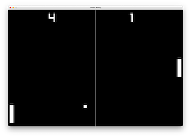

# Gofra [beta]

**A Stack-based compiled programming language.**

**The project is made not for competing with other languages, rather it is another incomplete language almost same like others.**

[](https://github.com/kirillzhosul/gofra/actions/workflows/testkit.yml)

---
#### [Documentation and information is available here](https://kirillzhosul.github.io/gofra)
---

## Overview
Gofra is a **concatenative** (stack-based) programming language that compiles to native code. 
Programs are written using [Reverse Polish notation](https://en.wikipedia.org/wiki/Reverse_Polish_notation), where operations follow their operands (e.g `2 + 2` is `2 2 +`).



## Quick start 

Here's a simple **"Hello, World!"** example:
```gofra
include "std"

func void main
    "Hello, World!" println
end
```

## Features
- *Native* - Compiles to native machine code
- *C*-like - Close to C, but has a few more high-level abstraction (`for in`, `type generics`)
- *C FFI* - Seamless integration with **C**-FFI libraries
- *Low-level* - Write unsafe, low-level code with direct memory access
- *Type System* - Validate types at compile time, has compile-time warnings (Generics supports, typechecker)
- *Library* - By default has support for `math`, `random`, `network` and other libraries

## More complex examples
```gofra
#include "std"

// Print each array element
var xs = ["Hello", " ", "world!", "\n"]

func void main[]
    for x in xs do
        x ?> print
    end
end
```

## Showcase
- Pong Game ([`examples/03_pong`](./examples/03_pong.gof))
- Simple HTTP server ([`examples/04_http_server`](./examples/04_http_server.gof))

## Platform Support

| ARCH    | OS      | Support                    | Tested hardware      |
|---------|---------|----------------------------|----------------------|
| Aarch64 | Darwin  | :white_check_mark:*        | M1, MacOS Tahoe 26.1 |
| WASM    | **-**   | :heavy_exclamation_mark:** |
| x86_64  | Linux   | :heavy_exclamation_mark:** |

| ARCH    | OS      | Support                    | Tested hardware      |
|---------|---------|----------------------------|----------------------|
| Aarch64 | Windows | :x:                        |
| Aarch64 | Linux   | :x:                        |
| x86_64  | Darwin  | :x:                        |
| x86_64  | Windows | :bangbang:***              |

\* Main workflow of development, has *all* features \
** Incomplete, has bugs and not all features \
*** Windows x86_64 is not implemented, but has general wrappers for system calls and possibly can compiled with headache 

## Pre requirements

Before installing Gofra, ensure you have the following tools available system-wide:

- [Python >3.12.x](https://www.python.org)
- GNU/Mach-O Linker (ld) - For linking compiled objects
- Assembler (as) - Typically included with Clang LLVM compiler

## Installation

**For full installation steps, please visit [Installation](./installation.md) page.**

[Gofra](https://github.com/kirillzhosul/gofra) is distributed as single Python-based toolchain. To install:

(Step 1): Install toolchain
```bash
pip install gofra
```
(Step 2): Verify Installation
```bash
gofra --help
```

## More information and next steps

Please refer to actual [documentation](https://kirillzhosul.github.io/gofra)!